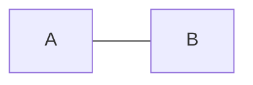
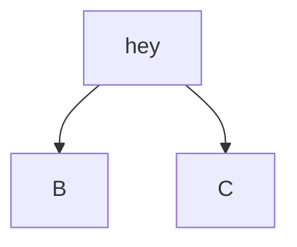
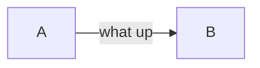
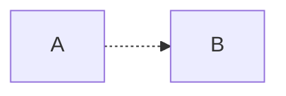
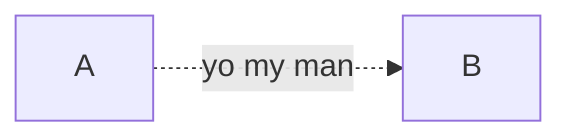
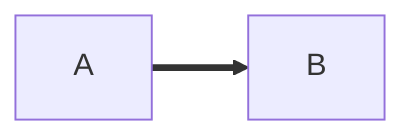

#tutorial 

## defintion of transcluding
 we can include other block fully
 ***
### embedding links

[obsidian](https://obsidia.md)
syntax  [sandesh]()

---

## Formatting

**Bold** __Bold2__

*italic*  _Italic2 _

_**Bold italic**_

~~stikethrough~~

==highlighting==


---

## bullets
- first bullet
- second bullet
- third bullet
	- press tab to indent bullet
* can also use asterisk

## LIne break( can use ***)


### Blockquotes
> Men must live to the point of tears and create
> \- Albert camus
> >1950
>
>Nested


---

### Task List
- [ ] first item
- [ ] second item
	- [x] second one item (Nested)
- [ ] done shut up now ^3c6fc2

---
					
### Alias
- [[Whats app|yo]]
- [[dgbfhjbdhgbgdbjgbbgdfgghfbhydshjdshbvf]]
- [[Whats app\|yo]] 
###### note :  use backslash if something is wrong it wont change anything
[[sandesh| my name]] 
[[disgrace|whatsup]]


---


#### HIGHLIGHTS
==highlight==


---^

### Footnote
this is my footnote,[^1]
this is my foornote,[^2]


[^1]: What the fuck
[^2]: what the hell


## OR
this is my footnote, ^[can you read this]

---

## NOTE
\ this backslash is used to escape things

---

## Linking to heading

[go to frommatting](#Formatting)

## Using footnotes to link tp page
this is connected to^[[[sandesh]]]

## creating a table
| sandesh | samartha | wankhade |
| -------  | ---------| -------- |
 |name | middle | Last name
 |adesh | samartha | wankhade
 
 | sandesh | samartha | wankhade |
| :-------  | :---------:| --------: |
 |name | middle | Last name
 |adesh | samartha | wankhade
 | left para |middle para | right para
 | | can insert image too in table|   |


 
## link head

[[tutorial#NOTE]]
[[tutorial#NOTE| display just this]]
[[#^3c6fc2| done now this is block refernece]]

## Transcluding
![[tutorial#defintion of transcluding]]
![[tutorial| ]] 
 ***
 
 term  
: definition
ffgfhbfghfghbf
 
 
## Diagrams














``` dataview
list
FROM  outgoing([[Sun and steel]])
SORT  DESC
```