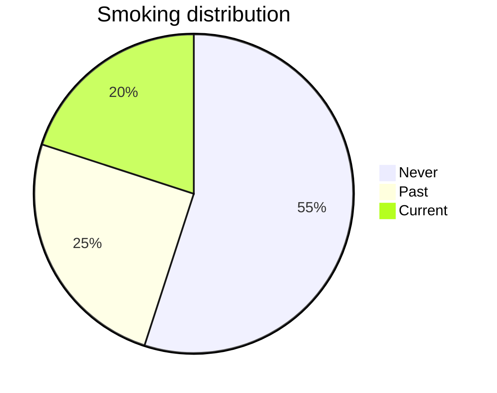

- Also known as **Qualitative** 
- disease is recorded in yes or no but can be also recorded in 0 and 1 ,  0 means no and 1 means yes but that *doesn't make it numeric*
- also level of agreement scale can be represented in terms of numbers . **Numbers acts as label only**
	- agree , strongly agree , disagree......

**Further divided into -**
# [[Nominal]]
# [[Ordinal]]
# Summarizing + Displaying categorical variable

## Example

X= smoking status (never , past , current)

### Frequency Table(Distribution)
```chart
type: bar
labels: [never,past,current]
series:
  - title: %
    data: [55,25,20,100]
width: 80%
beginAtZero: true
```


| smoking status | frequency | proportion |  %  |
|:--------------:|:---------:|:----------:|:---:|
|     never      |    110    |    0.55    | 55  |
|      past      |    50     |    0.25    | 25  |
|    current     |    40     |    0.2     | 20  |
|     Total      |    200    |     1      | 100 |

 this table shows the **distribution**
 
### Bar chart

```chart
type: bar
labels: [Never,Past,Current]
series:
  - title: Distribution 
    data: [55,25,20]
tension: 0.45
width: 74%
labelColors: true
fill: true
beginAtZero: true
```


### Pie chart


